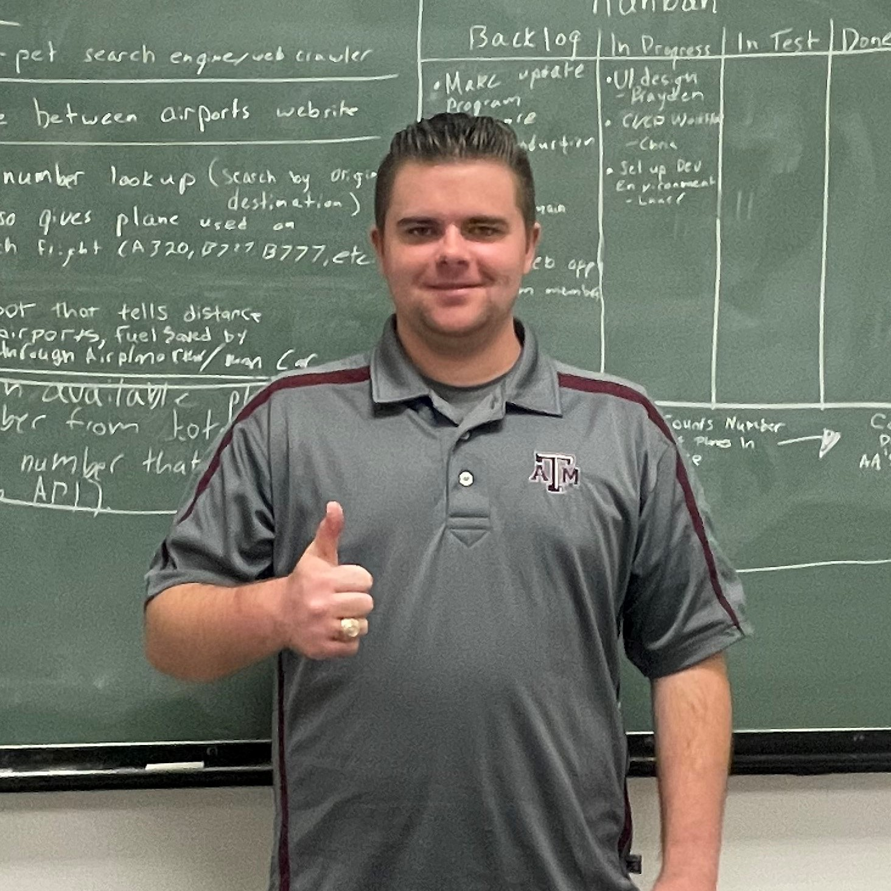
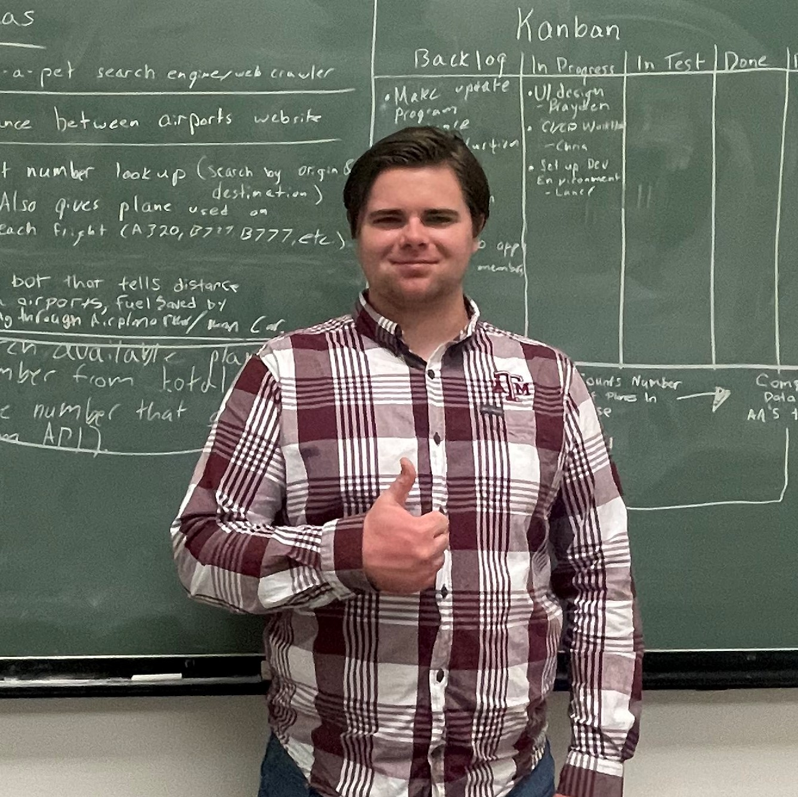
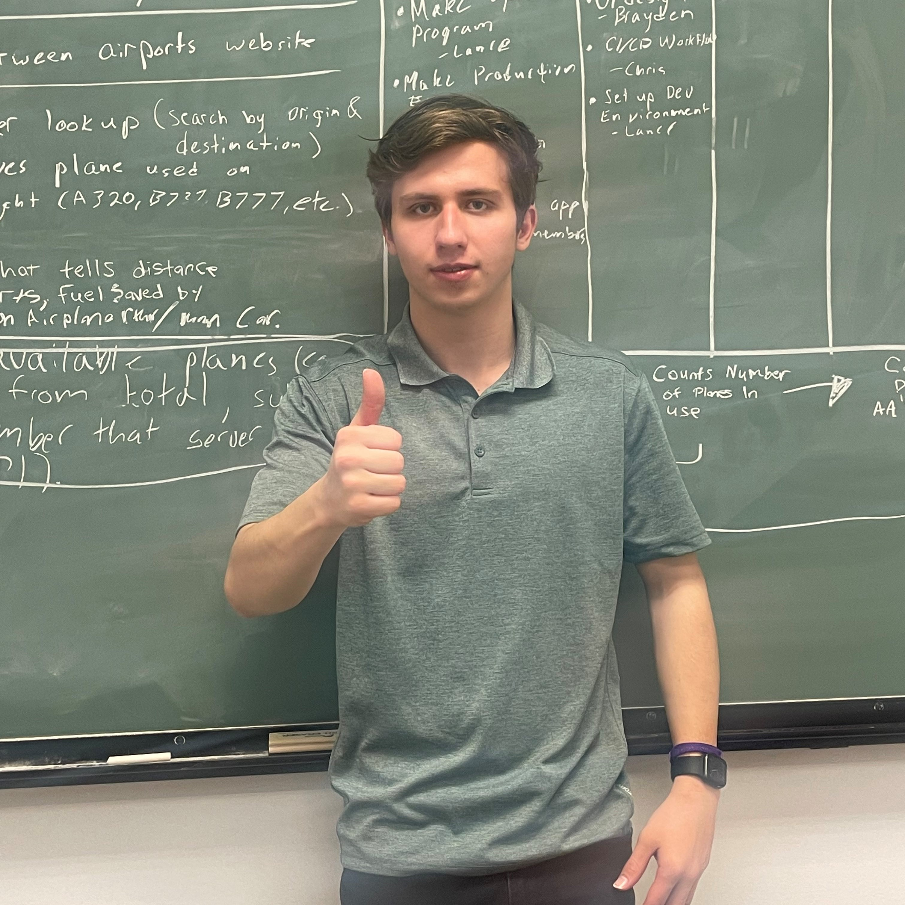

[link to our page](https://tamuhack-2022.github.io/flight-computer/index.html)

TAMUHack 2022, Team Name: The Profreshionals
--

Howdy!

Thank you for viewing my team's project! 

About Us
--

Christopher Merkle '22, Technology Management TAMU 
 
Lance Merkle '22, Industrial Distribution, TAMU 
 
Brayden Stewart '24, Petroleum Engineering, TAMU 
 

We're all new to hackathons, so we're really just here to see what they're all about! 

About our project: Online Flight Computer
--
Since this was our first hackathon, we decided to make something simple and use this as an opportunity to start learning JavaScript. 

We started out trying to think of ideas for the American Airlines challenge and we came to the conclusion that while we were at it, we should make something that's useful for our own purposes too. 

All of our team members love aviaiton, either in real life, or in simulation so we decided to make a web app for preflight calculations that could easily be expanded later on. 

When pilots are preparing for flight, there are a few calculations they have to make and we thought it would be helpful to make a web app that would perform those calculations for them. 
